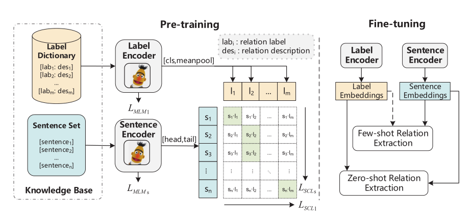

# Synergistic Anchored Contrastive Pre-training for Few-Shot Relation Extraction

## Overview

The Dataset and code for paper [Synergistic Anchored Contrastive Pre-training for Few-Shot Relation Extraction](https://arxiv.org/abs/2312.12021).



## Requirements

```
GPU=NVIDIA A100 Tensor Core
Python=3.7
Pytorch=1.13.0
```

## Pre-training

```shell
cd pre-train/code
bash train.sh
```

## Fine-tuning

Step1. Select the down-stream baseline and train

```shell
cd fine-tune
bash run_train.sh
```

Step2. Select the down-stream baseline and test

```shell
cd fine-tune
bash run_test.sh
```

## Citation

```
@misc{daluo2023synergistic,
      title={Synergistic Anchored Contrastive Pre-training for Few-Shot Relation Extraction}, 
      author={DaLuo and Yanglei Gan and Rui Hou and Run Lin and Qiao Liu and Yuxiang Cai and Wannian Gao},
      year={2023},
      eprint={2312.12021},
      archivePrefix={arXiv},
      primaryClass={cs.CL}
}
```

